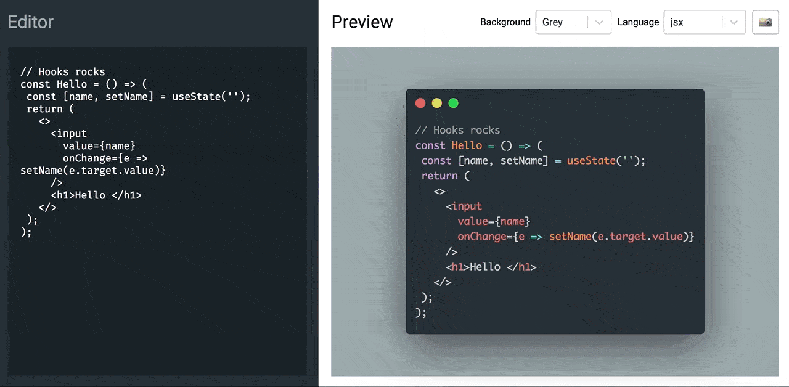

# CodeSample Editor

📸 A [carbon](https://carbon.now.sh)-like code sample editor to display beautiful code snippets on twitter 🦄

*Developed in a few hours with React (+hooks) and some open source libraries 🙏.*

## Try it!

[https://fbarrailla.github.io/codesample-editor/](https://fbarrailla.github.io/codesample-editor/)

## Credits

__Made with love thanks to__

- [React](https://facebook.github.io/react/)
- [Redux](http://redux.js.org/)
- [React Syntax Highlighter](https://github.com/conorhastings/react-syntax-highlighter)
- [Styled components](https://www.styled-components.com/)
- [html2canvas](https://html2canvas.hertzen.com/)
- [Canvas2Image](https://github.com/hongru/canvas2image)
- [React Color](https://github.com/casesandberg/react-color/)
- [React-Select](https://github.com/JedWatson/react-select)
- [...](./package.json)
